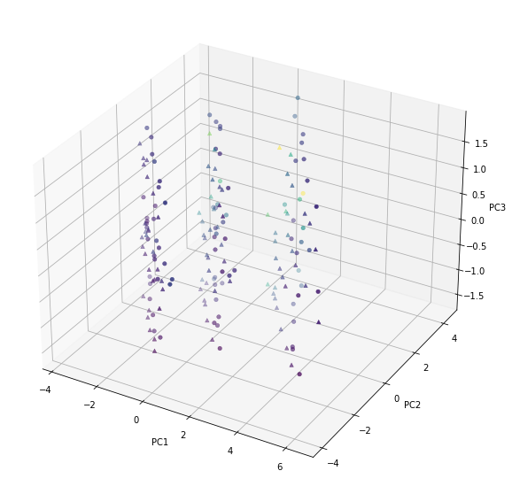
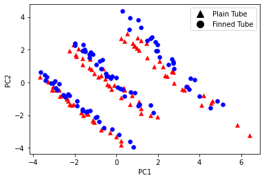
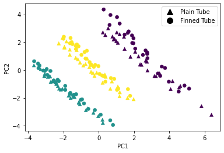

In this study, we use the following dataset obtained from two separate experiments with different operating conditions. The first dataset is obtained from a boiling experiment with a single tube in a vertical orientation. The second dataset is obtained from a boiling experiment with a bundle of 19 tubes in a horizontal orientation. The details of the input and output variables are given in Tables 1-3.

# Imports

## Definitions

Raw inputs:

|Input|Unit|Symbol|Description|
|:---|:---|:---|:---|
|`Input 1`|$kg/m^2s$|$G$|Mass flux|
|`Input 2`|$Pa$|$P_{sat}$|Saturation pressure|
|`Input 3`|$W/m^2K$|$q$|Heat flux|
|`Input 4`|-|$x$|Quality|
|`Input 5`|$Pa$|$\Delta P_t$|Pressure drop|

*Table 1: Raw inputs for the single tube dataset*

Calculated inputs:

|Input|Unit|Symbol|Description|
|:---|:---|:---|:---|
|`Input 1`|-|$Re_l$|Reynolds number|
|`Input 2`|-|$X_{tt}$|Two-phase multiplier|
|`Input 3`|-|$Fr_l$|Froude number|
|`Input 4`|-|${We}_{L}$|Weber number|

*Table 2: Calculated inputs for the single tube dataset*

Outputs:

|Output|Unit|Symbol|Description|
|:---|:---|:---|:---|
|`Output 1`|$W/m^2K$|$h_{TP}$|Heat transfer coefficient|

*Table 3: Outputs for the single tube dataset*

\* *Pressure drop ($\Delta P_t$) from input table and heat transfer coefficient ($h_{TP}$) from the output table are interchanged and machine learning algorithms below are trained to predict the pressure drop and the heat transfer coefficient separately.*

# Data

|Mass flux|Saturation pressure|Heat flux|Quality|Pressure drop|Heat transfer coefficient|Reynolds number|Two-phase multiplier|Froude number|Weber number|Bond number|Tube type|Heat transfer coefficient|
|----|----|----|----|----|----|----|----|----|----|----|----|----|
|190.393921|589276.392344|10183.667411|0.286821|1908.497264|5624.26494|0.463739|0.287211|29.665103|0.317264|3744.893193|Plain tube h|3744.893193|
|190.393921|591130.402063|10306.572617|0.306536|2238.123367|5475.898804|0.426594|0.287399|29.722737|0.294672|3906.912259|Plain tube h|3906.912259|
|190.393921|591645.979654|10291.105025|0.360759|2184.774106|5049.426582|0.342545|0.287446|29.738299|0.242476|3658.382794|Plain tube h|3658.382794|
|190.393921|590962.351114|10336.957572|0.456461|2998.877317|4291.402048|0.239386|0.287352|29.715816|0.176314|4117.791176|Plain tube h|4117.791176|
|190.393921|591167.124112|10260.169839|0.583378|2961.531281|3289.825912|0.151131|0.287399|29.723428|0.117153|4183.575561|Plain tube h|4183.575561|

*Table 4: Sample dataset*

# Segmentation

We first apply an unsupervised PCA decomposition to the dataset in order to identify different patterns in the data. These segments are considered when sampling data for train/test and cross-validation operations.

*Figure 1: PCA decomposition of the dataset*

## Performing segmentation

Given below in Figure 1 is a 3d visualization of the dataset using the first three principal components. The data is colored according to the value of heat transfer coefficient.

*Figure 1*

By observing the PCA plot, we can see that the data is clustered into three distinct groups, mainly separated across first two principal components.

|Input type|Input|PCA 1|PCA 2|PCA 3|
|:---|:---|:---|:---|:---|
|`Raw`|`Input 1`|0.371403|0.336128|-0.052853|
|`Raw`|`Input 2`|0.035643|-0.027975|0.788325|
|`Raw`|`Input 3`|-0.031835|0.044657|0.605993|
|`Raw`|`Input 4`|-0.338355|0.365280|0.057596|
|`Raw`|`Input 5`|0.072366|0.519421|0.003173|
|`Calculated`|`Input 1`|0.456948|-0.059758|-0.012223|
|`Calculated`|`Input 2`|0.348064|-0.364637|0.024985|
|`Calculated`|`Input 3`|0.379246|0.325789|-0.015902|
|`Calculated`|`Input 4`|0.380145|0.321854|0.053131|
|`Calculated`|`Input 5`|0.348953|-0.367088|0.036692|

*Table 4: Projection axes by inputs*

In the next step, we will use agglomerative clustering to segment the data into three groups with regard to the first two principal components. The results are given below in Figure 2.

# Principal component analysis

Apart from three distinct clusters, principal component analysis on the dataset also reveals a sub-seperation within each cluster by tube type. This is given below in Figure 2.

*Figure 2: Samples in principal component space. A sub-separation exists by tube type in each cluster.*

## Agglomerative clustering

We use agglomerative clustering to automatically segment the data into three groups. Results are given below in Figure 3 again in principal component space. On top of cluster configuration obtained by agglomerative clustering, we also define a sub-cluster category by tube type.

*Figure 3: Hierarchical clustering results visualized in principal component space*

# Split

Dataset is split into two parts by stratified sampling across the cluster labels. The first part is used for training/validation and tuning of the model hyperparameters. The second part is used for testing the final model.

## Scoring definitions

### $R^2$

$R^2$ is a statistical measure of how close the data are to the fitted regression line. It is also known as the coefficient of determination, or the coefficient of multiple determination for multiple regression. In this study, we use the following definition of $R^2$:

$$ R^2 = 1 - \frac{\sum_{i=1}^{n} (y_i - \hat{y}_i)^2}{\sum_{i=1}^{n} (y_i - \bar{y})^2} $$

where $y_i$ is the true value of the $i$th sample, $\hat{y}_i$ is the predicted value of the $i$th sample, and $\bar{y}$ is the mean value of the true values.

It is important to note that $R^2$ can be biased upwards for models with more parameters, even if they are meaningless. This is called the [overfitting] phenomenon. To avoid this, we use the adjusted $R^2$ score, which is defined as:

$$ R^2_{adj} = 1 - \frac{(1 - R^2)(n - 1)}{n - p - 1} $$

where $n$ is the number of samples and $p$ is the number of model parameters.

### MAE

Mean absolute error (MAE) is a measure of difference between two continuous variables. For two vectors $y$ and $\hat{y}$, MAE is defined as:

$$ MAE = \frac{1}{n} \sum_{i=1}^{n} |y_i - \hat{y}_i| $$

### RMSE

Root mean squared error (RMSE) is a quadratic scoring rule that also measures the average magnitude of the error. It is defined as:

$$ RMSE = \sqrt{\frac{1}{n} \sum_{i=1}^{n} (y_i - \hat{y}_i)^2} $$

$RMSE$ can be driven up by outliers and does not indicate under- or over-estimation. To address this issue, we use the mean absolute percentage error (MAPE) and weighted absolute percentage error (WAPE) scores whose details are given below that penalize errors relative to the true value.

### MAPE

Mean absolute percentage error (MAPE) is a measure of prediction accuracy of a forecasting method in statistics. For two vectors $y$ and $\hat{y}$, MAPE is defined as:

$$ MAPE = \frac{100}{n} \sum_{i=1}^{n} \left| \frac{y_i - \hat{y}_i}{y_i} \right| $$

### WAPE

Weighted absolute percentage error (WAPE) is a measure of prediction accuracy of a forecasting method in statistics. For two vectors $y$ and $\hat{y}$, WAPE is defined as:

$$ WAPE = \frac{100}{\sum_{i=1}^{n} y_i} \sum_{i=1}^{n} \left| y_i - \hat{y}_i \right| $$

### Weighted Bias %

Weighted percentage bias is a measure of systematic error in regression models. For two vectors $y$ and $\hat{y}$, weighted percentage bias is defined as:

$$ Weighted Bias \% = \frac{100}{\sum_{i=1}^{n} y_i} \sum_{i=1}^{n} \left( -y_i + \hat{y}_i \right) $$

Checking bias of the model is essential especially when modeling physical phenomena and built models are possibly used for extrapolation. In such cases, a model with a non-zero bias is not reliable.

### Hocanin score

Hocanin score is a measure of prediction accuracy of a forecasting method in statistics. For two vectors $y$ and $\hat{y}$, Hocanin score is defined as:

$$ Hocanin = \frac{1}{n} \sum_{i=1}^{n} \left( \frac{y_i - \hat{y}_i}{y_i} \right)^2 $$

# Models

Different models are trained for each cluster. The models are trained using the training/validation dataset and tuned using the validation dataset. The final model is evaluated using the test dataset. The models are trained using the following algorithms:

* [ANN]
* [AdaBoost regressor of decision trees]
* [Locally weighted linear regression]

## MLP definition

ANN configuration we use in this study is as follows:

* 2 hidden layers with 40 and 10 neurons
* `relu` activation function

### ANN search

We use grid search to find the best hyperparameters for the ANN model. The hyperparameters we search are:

* `hidden_layer_sizes`: The number of neurons in the hidden layers
* `activation`: The activation function for the hidden layers
* `tolerance`: The tolerance for the optimization algorithm

Hyperparameter search is executed through a 3-fold cross validation scheme and train/test folds are stratified by 6 cluster labels described in Section x.

Training data is split into 10-folds by following the exact same stratification approach described above, and hyperparameter selection process is repeated on each fold. The best hyperparameters are selected based on the average performance across the folds. Results for each fold are given below in Table x.

The cross-validation results:

|Score type|Mean|Standard deviation|Minimum|25%|50%|75%|Maximum|
|---|---|---|---|---|---|---|---|
|$R^2$|0.8385|0.0983|0.6107|0.8205|0.8490|0.8890|0.9516|
|MAE|-324.4948|98.8830|-475.7393|-364.9229|-324.8835|-284.3145|-169.3304|
|MAPE|6.46%|1.79%|9.93%|6.88%|6.52%|5.88%|3.65%|
|WAPE|6.51%|2.08%|10.38%|7.59%|6.27%|5.74%|3.51%|
|Bias|0.20%|2.82%|-2.67%|-1.94%|-0.92%|1.53%|5.01%|
|Hocanin score|0.8520|0.0960|0.6980|0.7873|0.8890|0.9193|0.9831|

*Table 5. 10-fold cross-validation results for the ANN model.*

